# Slack-Realtime-App

Some functions of this app:
📡 Real time communication
👍 Reactions to messages
🧵 Threads / Replies system
✏️ Editing messages 
🗑️ Deleting messages 
🔐 Role based access control 
🖼️ Image attachments 
🔒 Authentication with Next auth v5
📺 Channel creation
🏢 Workspace creation
✉️ Invite system / Invite codes
💬 Direct messaging
👥 User profiles
⚛️ Framework Next.js 14
🚀 Deployment on Vercel
🎨 Shadcn UI & Tailwind CSS

# Authentication with Next auth v5
    Login in with credential, google or github
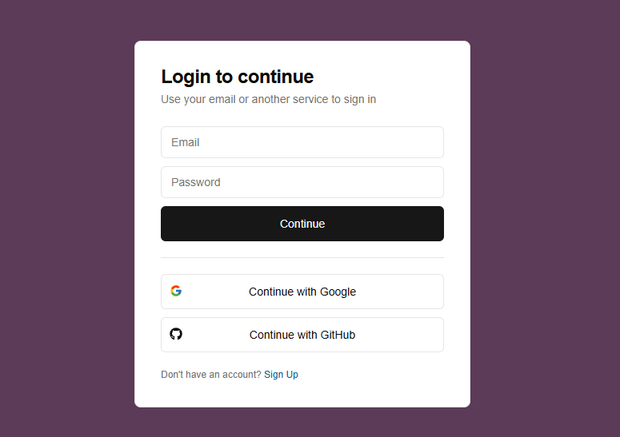

    Sign up with the similar feature
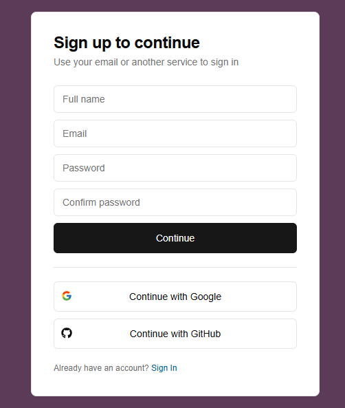

    General layout
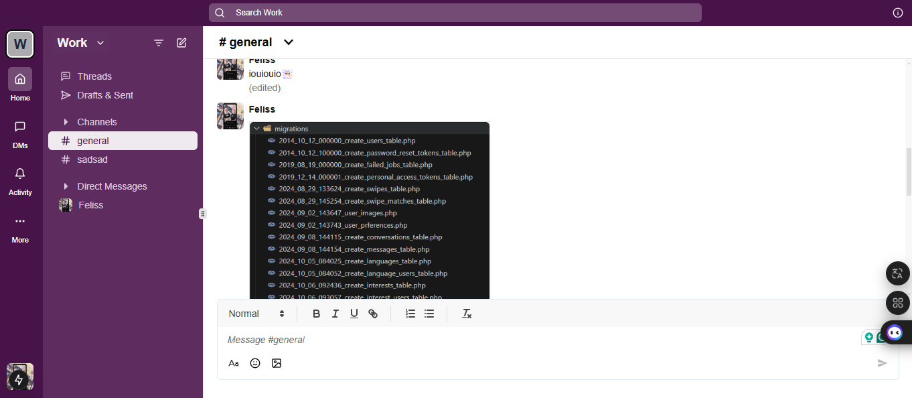

    Create workspace for new members
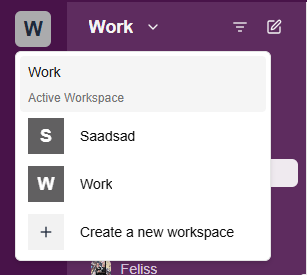
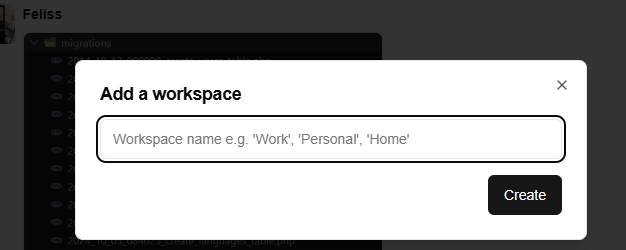

    Workspace contains many channels and many direct message
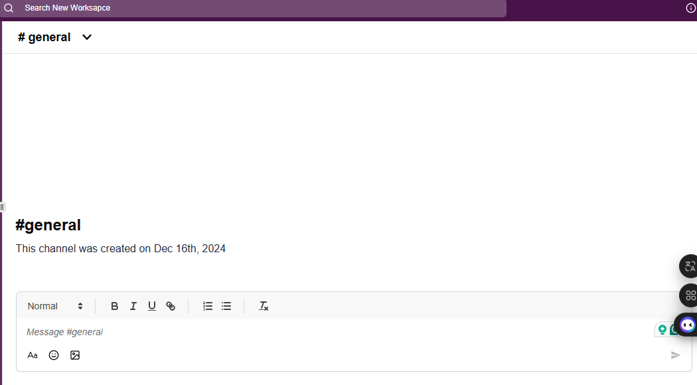

    Add new channelchannel
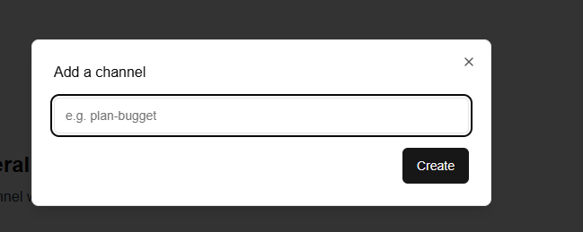

    Delete or edit the workspace attribute
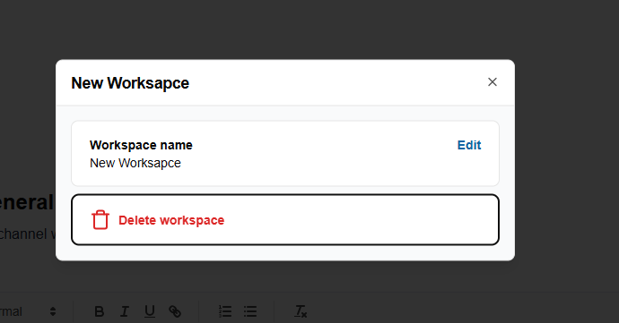

    Invite people to workspace by link

    Search cho existing members or channels
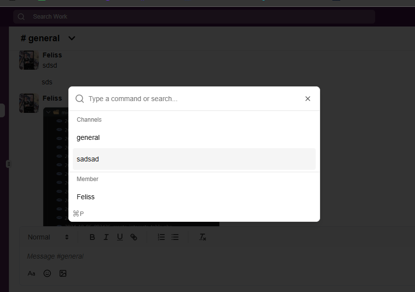

    Realtime message with customize styles

    Add reaction to each message
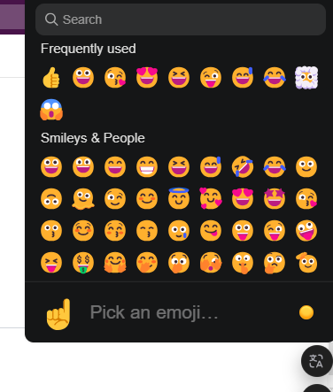

    Reply message in another thread
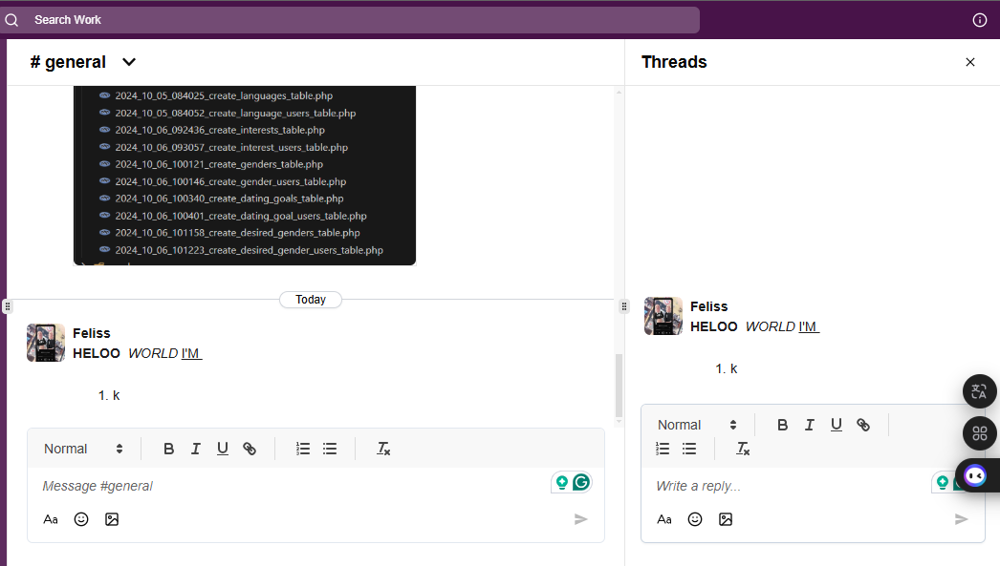

    Edit the message
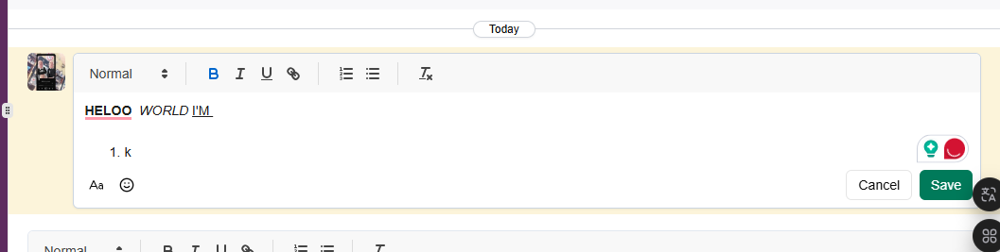
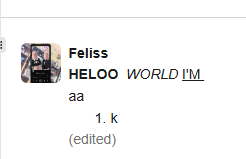

    Send file(image type first)
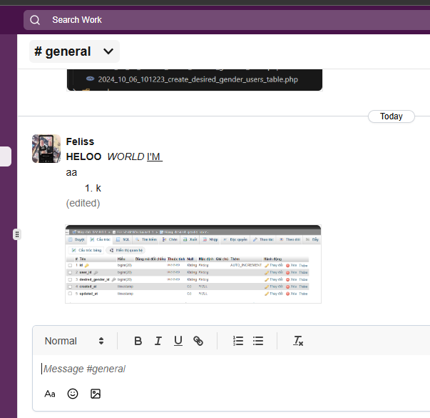

    Database using Convex Cloud
